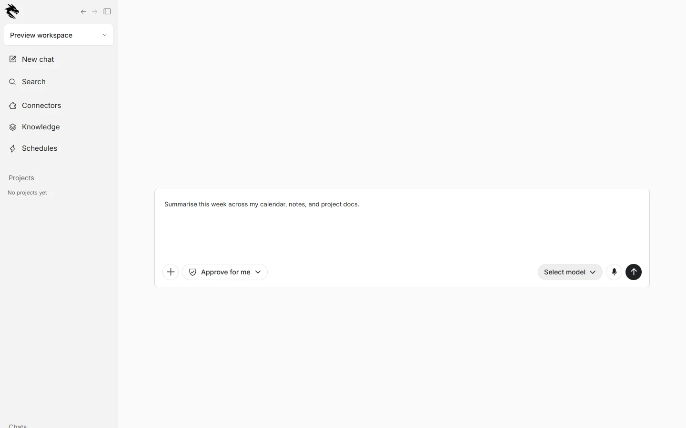
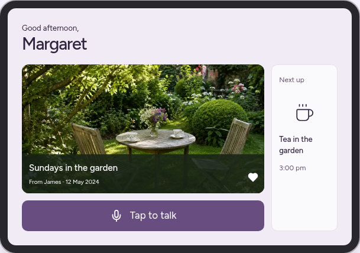
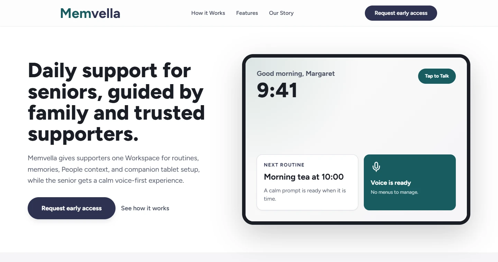
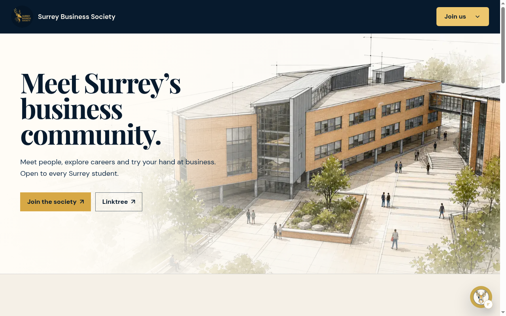
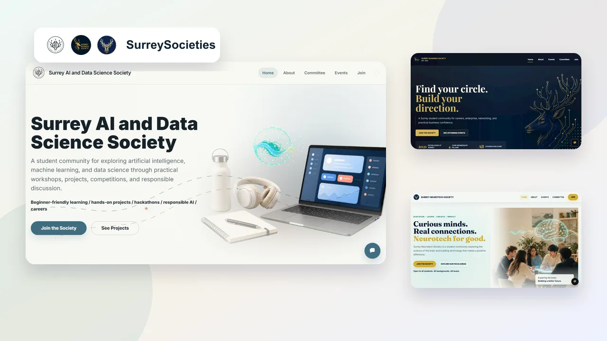
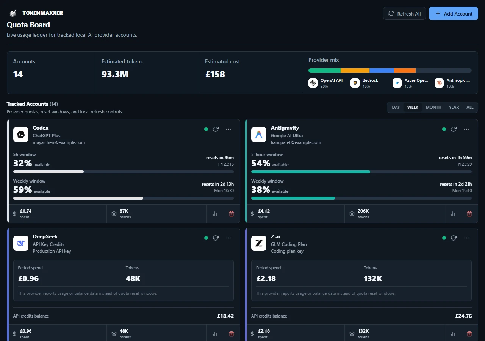

<p align="center">
  
</p>

<h1 align="center">Hi, I’m Joshua.</h1>

<p align="center">
  Politics student. Software builder.<br />
  I make products I’d actually want to use.
</p>

<p align="center">
  <a href="https://joshuaknott.tech">joshuaknott.tech</a>
  ·
  <a href="https://github.com/joshuasknott">GitHub</a>
  ·
  <a href="mailto:joshhknott@gmail.com">Email</a>
</p>

<p align="center">
  
</p>

## A bit about me

I’m a Politics and International Relations student at the University of Surrey. Outside my degree I’m President of Surrey’s Artificial Intelligence Society and Vice President of the Neurotech Society — and I previously led Surrey Business Society. I spend a lot of time designing and shipping software: desktop apps, care technology, and student community sites.

I care about craft: clear layout, honest copy, and interfaces that feel calm rather than loud. Most of what I build starts from a problem I hit myself, or one I think could make someone’s day a little easier.

Open to internships, freelance work, and collaborations.

## Selected work

### Mivlet

<p align="center">
  
</p>

**One place for your AI agents.** A provider-neutral, local-first workspace: named agents, desktop conversation, connections and approvals when the work needs them.

<p align="center">
  
</p>

### ollo

<p align="center">
  
</p>

**Your next role, with a little help.** A private Windows desktop workspace for a considered job search — fit-aware discovery, application drafts, and a calmer place to keep the search moving.

<p align="center">
  
</p>

### Memvella

<p align="center">
  
</p>

**Memory support without making life feel clinical.** I founded Memvella to help people with early-stage memory loss and the families supporting them — a calm companion alongside a supporter workspace for routines, memories, and trusted context. Memvella has received £1,500 from the University of Surrey Innovation and Enterprise Hub.

<p align="center">
  
</p>

<p align="center">
  
</p>

### Surrey Societies

Three separate public websites and admin tools for Surrey’s Artificial Intelligence, Business, and Neurotech societies — each with its own content, members, committee setup, and identity.

| AI Society | Business Society | Neurotech Society |
| :---: | :---: | :---: |
|  |  |  |

<p align="center">
  
</p>

### Also on the site

The live portfolio at [joshuaknott.tech](https://joshuaknott.tech) also features **Fable** (local-first AI desktop workspace), **TokenMaxxer** (local quota and spend tracking across AI accounts), and **BetWFriends** (private group bets with an internal wallet).

<p align="center">
  
  &nbsp;
  
</p>

## This repository

This is the source for **joshuaknott.tech** — a static personal site.

```text
index.html    page structure and copy
styles.css    layout, type, and motion
main.js       progressive enhancement
assets/       images, icons, project shots
data/         generated stats (via GitHub Actions)
```

No package manifest or build step. GitHub Pages–style deploy; please leave `CNAME`, `sitemap.xml`, `robots.txt`, and social metadata alone unless a task specifically needs them.

### Preview locally

```bash
python3 -m http.server 8080
# then open http://localhost:8080
node --check main.js
```

## Want to talk?

If you’re hiring, building something interesting, or think I could help — email me at [joshhknott@gmail.com](mailto:joshhknott@gmail.com).
