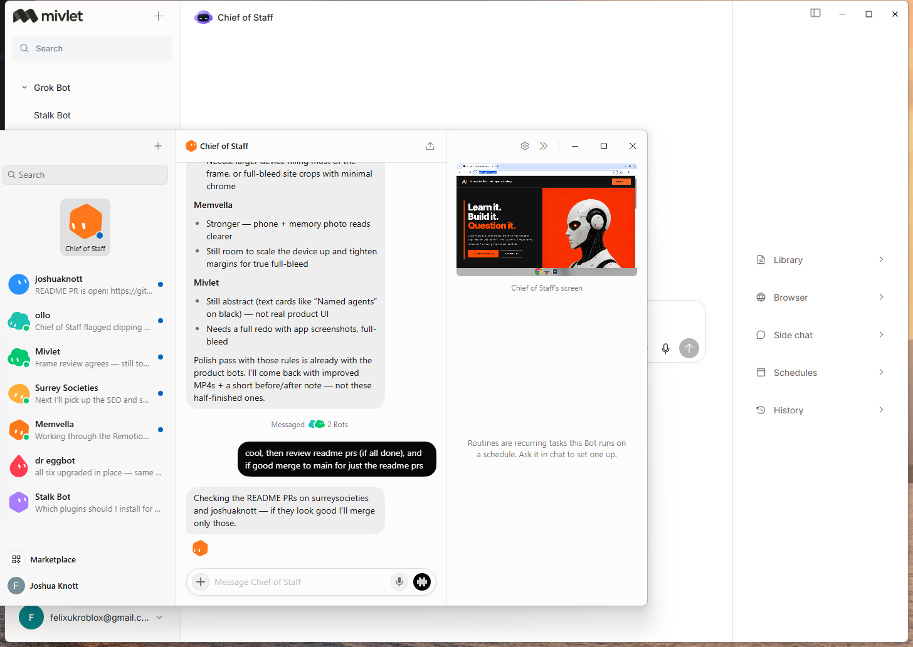
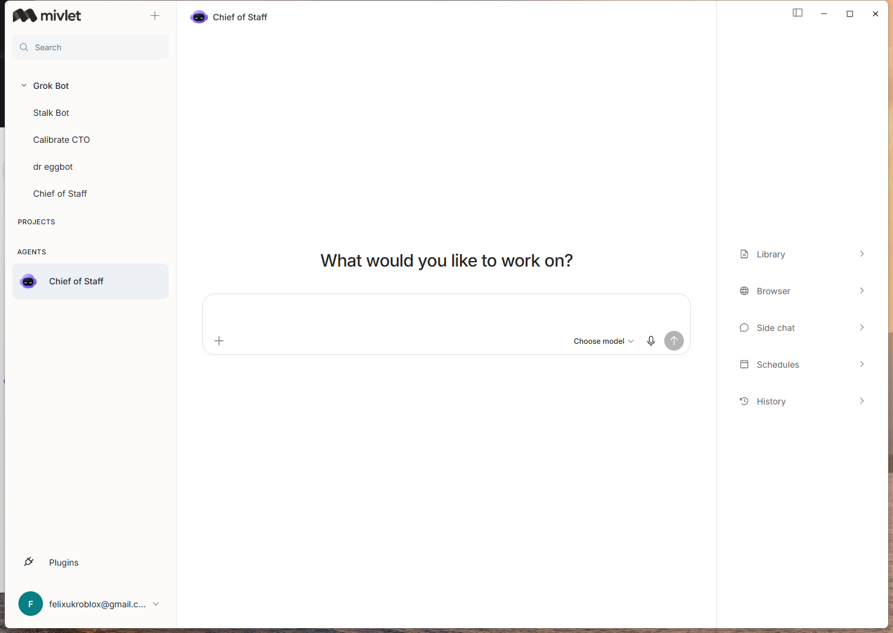
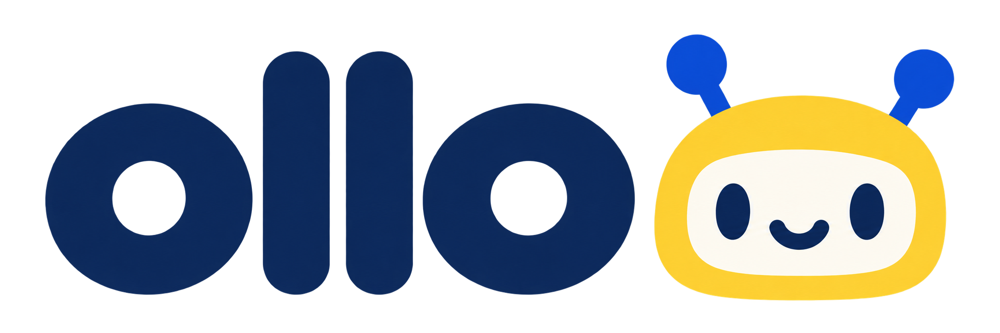
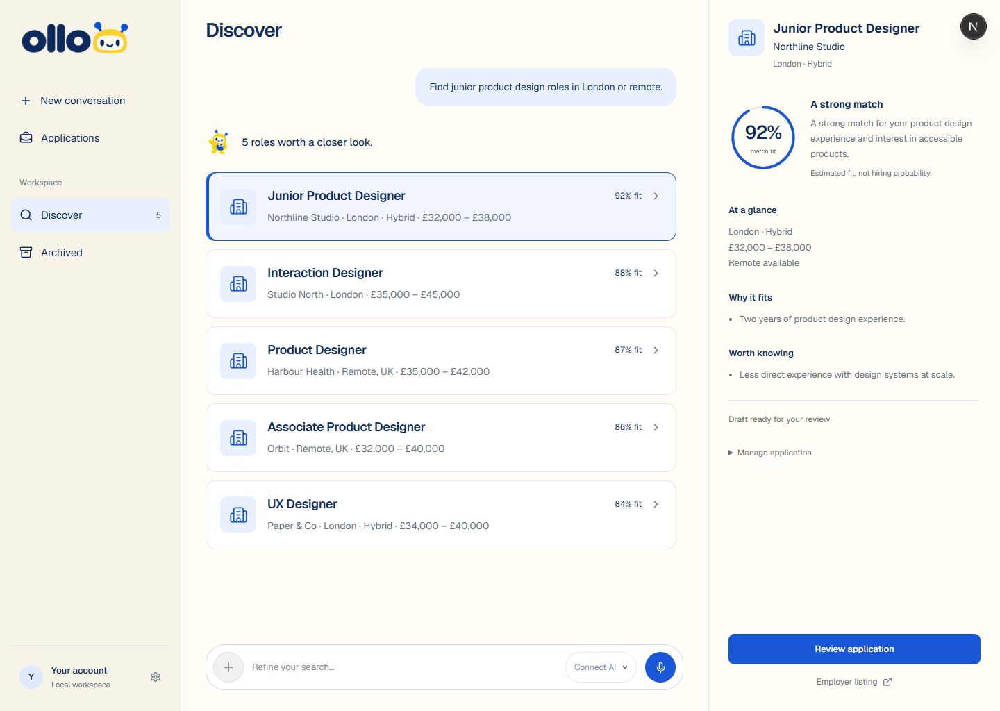
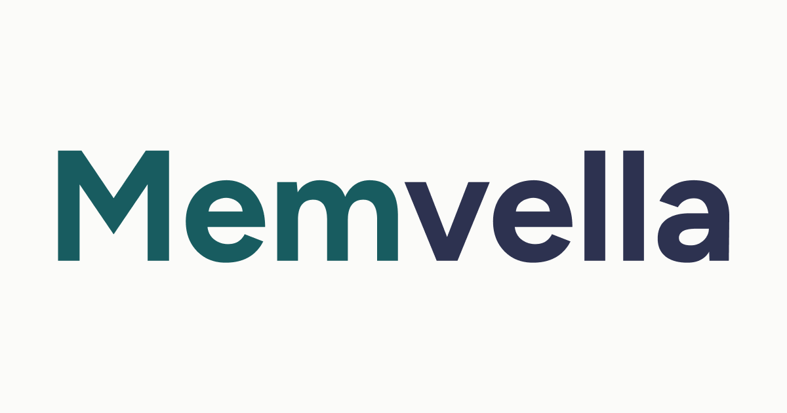
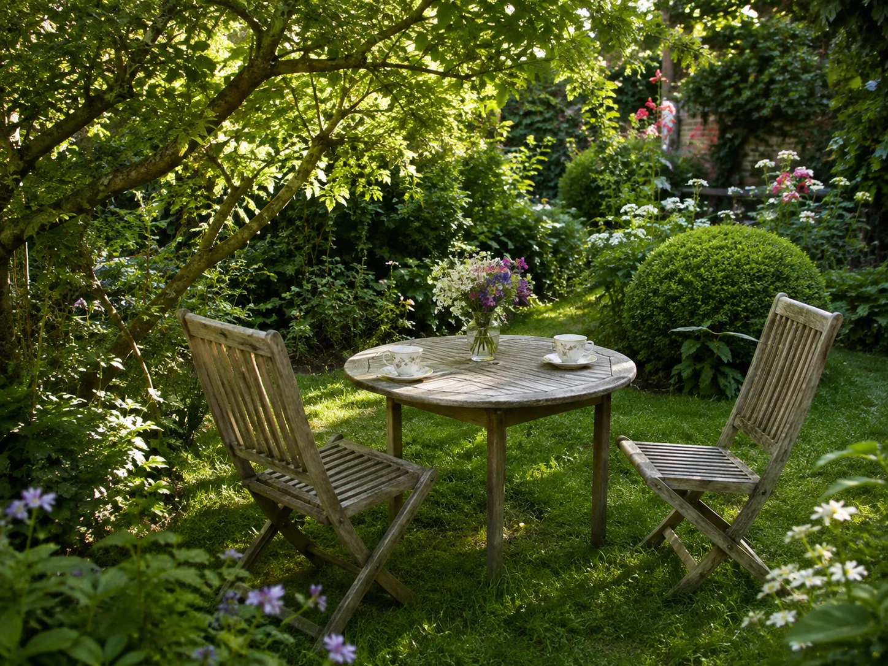
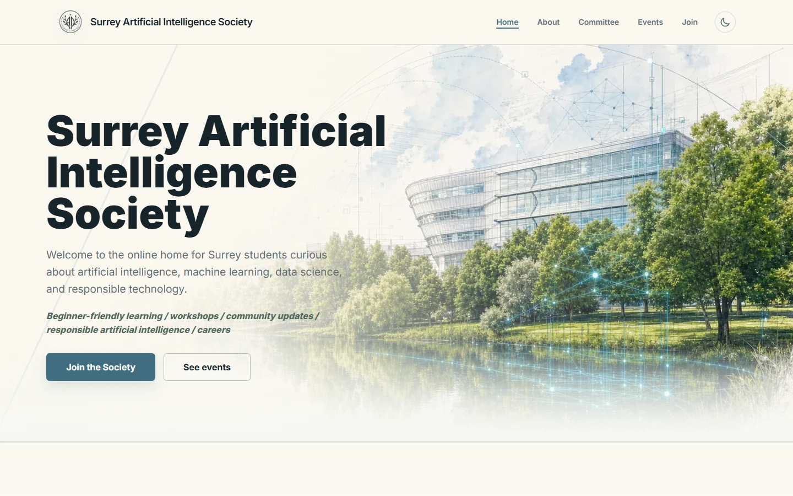
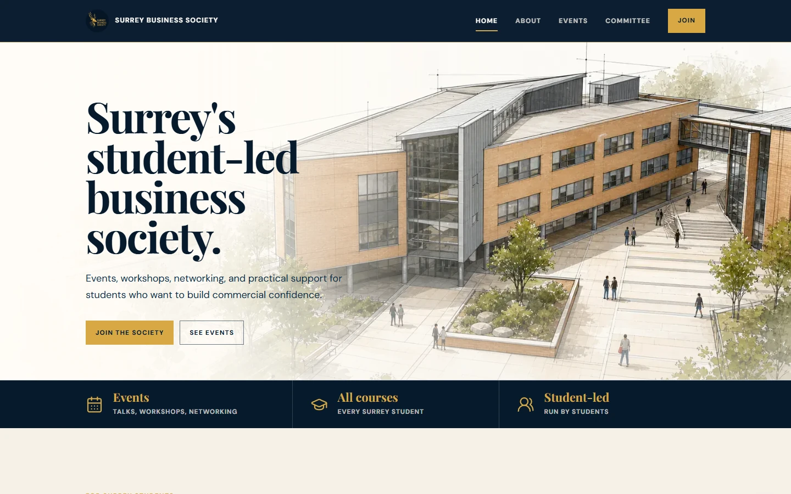
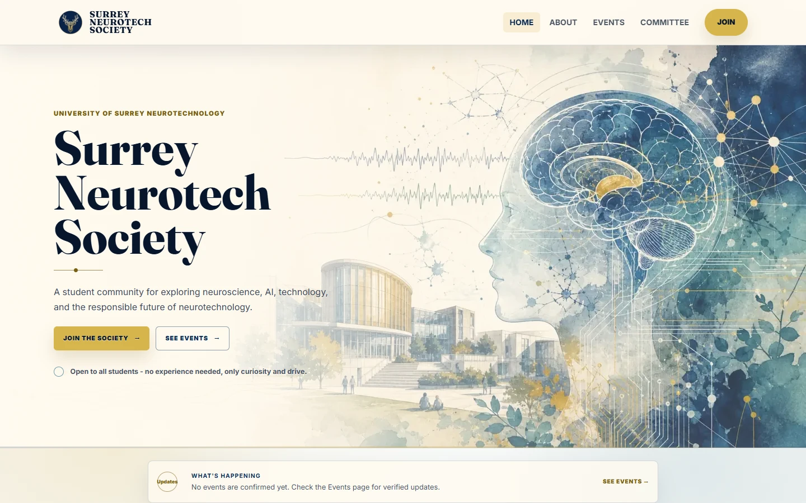

<p align="center">
  
</p>

<h1 align="center">Joshua Knott</h1>

<p align="center">
  Politics student · software builder<br />
  <a href="https://joshuaknott.tech">joshuaknott.tech</a>
  ·
  <a href="https://github.com/joshuasknott">GitHub</a>
  ·
  <a href="mailto:joshhknott@gmail.com">Email</a>
</p>

<p align="center">
  
</p>

I study Politics and International Relations at Surrey. I’m President of the AI Society, Vice President of Neurotech, and I build products I’d actually use.

---

## Mivlet

<p align="center">
  
</p>

One place for your AI agents — local-first, provider-neutral.

<p align="center">
  
</p>

<p align="center">
  
</p>

## ollo

<p align="center">
  
</p>

Your next role, with a little help — private Windows job-search workspace.

<p align="center">
  
</p>

## Memvella

<p align="center">
  
</p>

Memory support that doesn’t feel clinical. Founded for early-stage memory loss and the people around them. [memvella.me](https://memvella.me) · £1,500 from Surrey’s Innovation and Enterprise Hub.

<p align="center">
  
</p>

<p align="center">
  
  &nbsp;
  
</p>

## Surrey Societies

Three society sites — AI, Business, Neurotech — each with its own content and admin.

| AI | Business | Neurotech |
| :---: | :---: | :---: |
|  |  |  |

---

### This repo

Static site for **joshuaknott.tech** — `index.html`, `styles.css`, `main.js`, `assets/`, `data/`. No build step.

```bash
python3 -m http.server 8080
node --check main.js
```

Open to internships and collaborations — [joshhknott@gmail.com](mailto:joshhknott@gmail.com).
